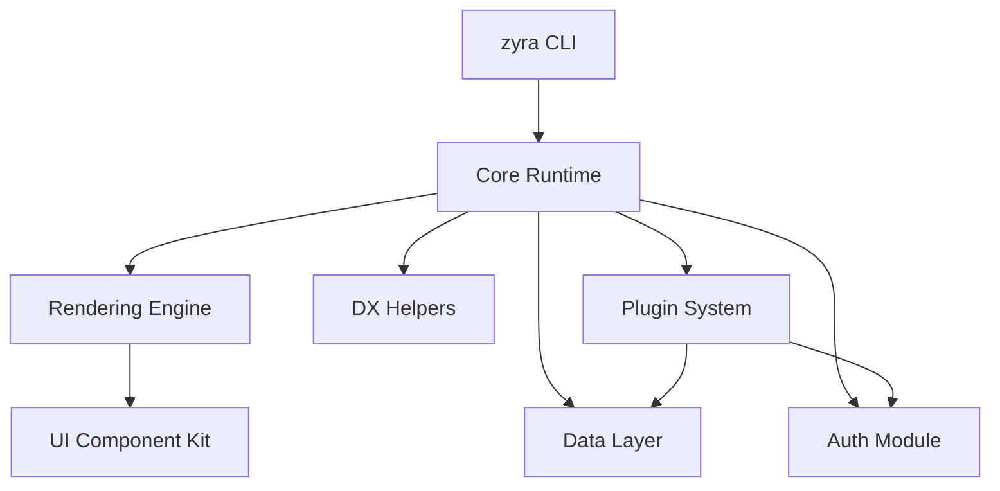
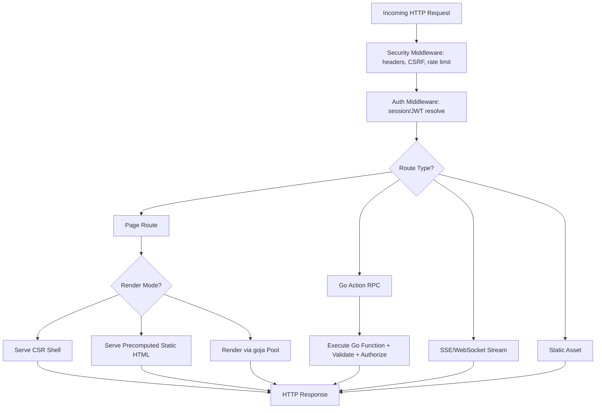

# 02 — Arsitektur Teknis Inti

## Ringkasan Keputusan Arsitektur

| Layer | Teknologi | Alasan |
|---|---|---|
| Bahasa backend | Go 1.23+ (stabil, bukan versi hipotetis) | Performa, single binary, cross-compile mudah |
| Frontend | React 18/19, TypeScript | Fokus satu ekosistem, dukungan tooling matang |
| Bundler | `evanw/esbuild` (Go module) | Sudah Go-native, tidak butuh Node, sangat cepat |
| SSR engine | `goja` + `goja_nodejs` (embedded, pure Go) | Zero-CGO, single binary tetap utuh, cross-compile tidak rumit |
| CSS | Tailwind CSS via Standalone CLI binary yang di-manage Zyra | Zero Node dependency, tetap dukungan Tailwind penuh |
| Router HTTP | `net/http` stdlib (Go 1.22+ pattern routing) + custom file-based page router | Minim dependency, standar Go modern |
| Database drivers | `lib/pq`/`pgx`, `go-sql-driver/mysql`, `modernc.org/sqlite` (pure Go, no CGO) | Konsisten dengan prinsip zero-CGO |
| Migration | `golang-migrate/migrate` sebagai library (bukan CLI eksternal) | Battle-tested, multi-DB, tetap terkompilasi ke binary |
| Observability | OpenTelemetry, Prometheus client, `zap` logger | Terintegrasi penuh, portable |
| CLI | `spf13/cobra` + `manifoldco/promptui` | Andal, interaktif, battle-tested |

## Prinsip Modul



Aturan boundary:

1. **`pkg/zyra/`** — satu-satunya API publik yang stabil (semver-guaranteed). Ini yang diimpor oleh kode aplikasi user (`import "github.com/LythianOlyx/Zyra/pkg/zyra"`).
2. **`internal/`** — implementasi. Boleh berubah struktur bebas antar minor version tanpa dianggap breaking change, selama `pkg/zyra` tetap kompatibel.
3. **`runtime/client/`** — kode TypeScript/React yang jadi bagian dari bundle aplikasi user (hooks, komponen dasar). Ini juga API publik dari sisi frontend — treat dengan disiplin stabilitas yang sama seperti `pkg/zyra`.
4. **`templates/`** — starter project yang di-*copy* saat `zyra create`. Bukan bagian dari binary runtime aplikasi user setelah di-generate (jadi bebas berubah antar rilis Zyra tanpa breaking existing user apps).
5. Modul dalam `internal/` tidak boleh saling depend secara sirkular. Urutan dependency satu arah: `config` → `observability`/`security` → `data`/`auth` → `render` → `server`.

## Struktur Folder Project Framework (repo Zyra sendiri)

```
zyra/
  cmd/
    zyra/                 # satu-satunya entry point CLI
  internal/
    cli/                  # implementasi subcommand: create, dev, build, generate, add, migrate, doctor, audit
    config/                # skema & loader zyra.config.ts/json
    router/                # file-based page router
    codegen/                # scanner+generator Go Actions -> TS
    render/                 # engine CSR/SSG/SSR (lihat 03-RENDERING-ENGINE.md)
      goja/                 # wrapper pool goja runtime
      tailwind/              # manager binary standalone Tailwind
      bundler/                # wrapper esbuild
    data/                   # query layer, migration runner, adapter multi-DB
    auth/                   # session, jwt, oauth, rbac
    dx/                      # helper: mail, upload, jobs, cache, validation, feature flags
    middleware/              # csrf, rate-limit, security headers
    observability/           # logging, tracing, metrics
    plugin/                  # plugin loader & lifecycle hooks
    server/                   # HTTP server wiring, graceful shutdown
    testhelpers/              # helper internal untuk unit/integration test
  pkg/
    zyra/                     # API publik stabil
  runtime/
    client/                    # hooks React, komponen dasar, devtools panel
  templates/
    blank/
    saas-starter/
    dashboard-admin/
    landing-page/
    ecommerce/
    ai-chat/
    blog-cms/
    realtime-collab/
    api-only/
    portfolio/
  website/                       # dikerjakan belakangan (lihat 16-WEBSITE-STRATEGY.md)
  zyraStrategy/                   # folder dokumen ini
```

## Request Lifecycle



## Konvensi Halaman (React, per-file)

Mengadopsi pola yang sudah familiar bagi jutaan developer React (mirip Next.js Pages Router) supaya kurva belajar rendah, tapi dijalankan oleh Go di baliknya:

```tsx
// pages/blog/[slug].tsx

// Mode render: "csr" (default) | "ssg" | "ssr"
export const renderMode = "ssg";

// Hanya untuk mode "ssg" — dijalankan sekali saat build (atau saat revalidate)
export async function getStaticProps({ params }) {
  const post = await db.posts.findBySlug(params.slug);
  return { props: { post }, revalidate: 3600 };
}

// Hanya untuk mode "ssr" — dijalankan setiap request di goja pool
export async function getServerSideProps({ params, request }) {
  const post = await db.posts.findBySlug(params.slug);
  return { props: { post } };
}

// SEO — dibaca oleh Rendering Engine untuk inject <head>
export function meta({ props }) {
  return {
    title: props.post.title,
    description: props.post.excerpt,
    og: { image: props.post.coverImage },
  };
}

export default function BlogPost({ post }) {
  return <article>{/* ... */}</article>;
}
```

## Config Tunggal & Ter-typed

Ganti `zyra.config.json` polos menjadi `zyra.config.ts` (tetap didukung `.json` untuk kasus sederhana), supaya ada autocomplete & validasi tipe saat development:

```ts
import { defineConfig } from "zyra/config";

export default defineConfig({
  port: 3000,
  database: { driver: "postgres", url: process.env.DATABASE_URL },
  security: { csrf: true, rateLimit: { requests: 100, window: "1m" } },
  auth: { strategy: "session", oauth: ["google", "github"] },
  seo: { siteUrl: "https://example.com", generateSitemap: true },
});
```

Skema config ini didefinisikan di Go (`pkg/zyra/config.go`) dan digenerate ulang jadi TypeScript type lewat mekanisme codegen yang sama dengan Go Actions — konsisten dengan prinsip "satu sumber kebenaran".

## Single Binary Embed Strategy

Semua ini di-embed via `//go:embed` ke satu binary hasil `zyra build`:

- Bundle JS/CSS hasil build (`dist/client/**`)
- Bundle SSR (`dist/ssr-bundle.js`) untuk dijalankan di goja pool
- File migration SQL (`migrations/**`)
- Template email bawaan (`internal/dx/mail/templates/**`)
- Aset publik (`public/**`)

Hasilnya: `./zyra-server` benar-benar cukup satu file untuk deploy — tidak ada folder tambahan yang harus ikut di-copy ke server produksi.

## Protocol RPC Go Actions & Error Envelope

Setiap fungsi Go yang diberi anotasi `// +zyraaction` didaftarkan otomatis ke endpoint HTTP internal `POST /_zyra/action/<Package>/<ActionName>`.

### Format Protocol Response (JSON):

```json
// Kasus Sukses
{
  "ok": true,
  "data": { ... }
}

// Kasus Error
{
  "ok": false,
  "error": {
    "code": "VALIDATION_FAILED | UNAUTHORIZED | FORBIDDEN | NOT_FOUND | INTERNAL_ERROR",
    "message": "Pesan error terstruktur ramah pengguna",
    "details": { "field": ["pesan validasi per-field"] }
  }
}
```

### Sanitasi Production & Guardrails:
1. **Error Sanitization di Production:** Jika Go Action mengalami `panic` atau mengembalikan unhandled error internal database di production, Zyra otomatis mengubahnya menjadi status `INTERNAL_ERROR` ("Terjadi kesalahan internal pada server") tanpa membocorkan stack trace / kredensial database ke client.
2. **Dev-Mode Rich Trace:** Di dev mode, error internal menyertakan stack trace Go lengkap yang siap di-copy ke AI Overlay via fitur *AI-Ready Error Overlay*.

