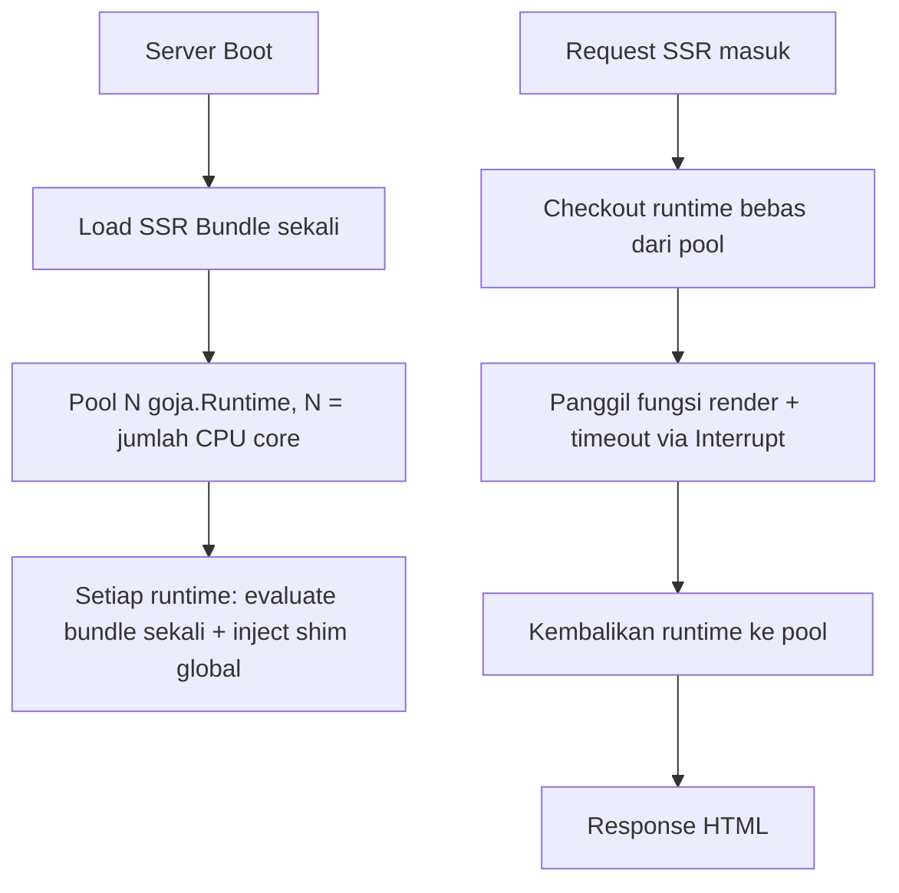

# 03 — Rendering Engine: Menghilangkan Bun, Tetap Mendukung Tailwind

Dokumen ini adalah jawaban teknis rinci untuk dua keputusan besar: **menghapus dependensi Bun** dan **tetap mendukung TailwindCSS penuh tanpa Node.js**.

## Desain Arsitektur Rendering Engine

### A. Tiga mode rendering per halaman

| Mode | Kapan jalan | Butuh JS engine di server? | Best for |
|---|---|---|---|
| `csr` (default) | Client-side, di browser | Tidak | Dashboard, app di balik login, internal tools |
| `ssg` | Sekali saat `zyra build` (atau saat `revalidate`) | Ya, tapi **hanya saat build**, hasilnya HTML statis di-embed | Landing page, blog, halaman marketing, produk katalog yang jarang berubah |
| `ssr` | Setiap request, on-demand | Ya, di server production (embedded, in-process) | Halaman yang butuh SEO **dan** data real-time per-request |

Developer memilih mode ini per file (`export const renderMode = "..."`), bukan dipaksa satu mode untuk seluruh project. Default project baru tanpa `renderMode` sama sekali = `csr`, supaya proyek yang tidak butuh SSR **tidak pernah menjalankan JS engine apapun di server**, sesuai prinsip zero-dependency.

### B. Engine SSR: `goja` (embedded, pure Go)

**Kenapa `goja`, bukan V8/QuickJS via CGO:**

- Pure Go — kompatibel penuh dengan `CGO_ENABLED=0`, tidak merusak matrix cross-compile GoReleaser (`linux/darwin/windows` × `amd64/arm64` dari satu CI runner).
- Tidak butuh shared library platform-specific yang mesti ikut di-bundle.
- `renderToString` React bersifat **sinkron** — tidak butuh event loop kompleks, jadi keterbatasan `goja` soal async scheduling tidak jadi blocker untuk SSR dasar.
- Trade-off yang diterima: `goja` lebih lambat dari V8 murni. Untuk render HTML per-halaman (bukan komputasi berat), ini tetap dalam budget milidetik yang wajar untuk mayoritas aplikasi.

**Desain pool runtime (wajib, bukan opsional):**

Detail implementasi kunci:

1. `goja.Runtime` **tidak** aman dipakai concurrent dari banyak goroutine sekaligus — karena itu wajib pakai pool (mirip pola `database/sql` connection pool yang sudah familiar bagi developer Go).
2. Setiap runtime di pool **sudah** meng-evaluasi bundle SSR sekali saat warm-up (bukan setiap request) — supaya biaya parsing JS tidak berulang.
3. Timeout wajib pakai `runtime.Interrupt()` milik goja untuk menghentikan eksekusi yang menggantung (misal infinite loop di kode user), dengan default timeout **200ms** per render request.
4. Shim global minimal yang wajib disuntik sebelum evaluate bundle: `console`, `TextEncoder`/`TextDecoder` (via `goja_nodejs`), `setTimeout`/`clearTimeout` (no-op atau synchronous-safe versi), `queueMicrotask`, `URL`/`URLSearchParams` shim, serta `crypto.getRandomValues` stub.
5. Mode dev: pool di-invalidate dan runtime baru dibuat ulang saat bundle SSR berubah (hot reload). Mode production: bundle fixed sejak `zyra build`, pool dibuat sekali saat boot.
6. Sediakan interface `SSRRenderer` di `pkg/zyra` (`Render(ctx context.Context, route string, props interface{}) (string, error)`) supaya implementasi bisa diganti di masa depan (misal ke V8-based engine via plugin CGO/IPC) tanpa mengubah API publik yang dipakai aplikasi user.

**Fallback wajib:** kalau proses render SSR gagal/timeout untuk request tertentu, otomatis fallback ke CSR shell untuk request itu (bukan 500 error ke user), dicatat sebagai warning di observability.

### C. Tailwind tanpa Node.js: Standalone Binary Manager

Tailwind CSS (sejak v3.3+) merilis **binary standalone resmi** per platform (`tailwindcss-linux-x64`, `tailwindcss-linux-arm64`, `tailwindcss-macos-x64`, `tailwindcss-macos-arm64`, `tailwindcss-windows-x64.exe`, serta `tailwindcss-linux-x64-musl` & `tailwindcss-linux-arm64-musl` pada v4+) — tidak butuh Node.js sama sekali.

Rencana implementasi `internal/render/tailwind/`:

1. **Deteksi & cache lokal.** Cek apakah binary versi yang dibutuhkan sudah ada di `~/.zyra/tools/tailwindcss-<version>-<os>-<arch>`. Kalau belum, download sekali dari GitHub Releases resmi Tailwind, verifikasi checksum SHA256 secara otomatis via `sha256sums.txt` (atau `TailwindConfig.Checksum`), simpan dengan permission executable.
2. **Dukungan Enterprise / Air-Gapped / Corporate Network & Alpine/Musl:**
   - Config `zyra.config` mendukung `downloadUrl` (opsional, untuk mengarahkan ke internal mirror/Artifactory/Nexus perusahaan).
   - Config `zyra.config` juga mendukung `binaryPath` (opsional, mengarahkan langsung ke file executable Tailwind lokal jika server CI/CD bersifat offline total).
   - Config `zyra.config` mendukung `libc` (`"musl"` | `"glibc"`) untuk Linux, dengan auto-detection Alpine Linux via `/etc/alpine-release`.
3. **Versi di-pin secara default, opsi `"latest"` opt-in.** Config project menyimpan `version` eksplisit (default: `DefaultTailwindVersion` pinned v4.x) untuk reproducible builds. Pengembang dapat mengatur `version = "latest"` untuk resolusi dinamik via GitHub API (`ResolveLatestVersion`).
4. **Tidak ada fallback ke `npx`.** Kalau download gagal (misal offline dan tanpa local path), CLI tampilkan error jelas dengan instruksi opsi mirror atau manual download path — jangan diam-diam gagal.
5. **Perintah CLI baru:** `zyra tailwind sync` (paksa download ulang/verifikasi versi), `zyra doctor` juga mengecek status binary Tailwind ini.
6. Cara panggil dari Go: identik dengan cara `esbuild` dipanggil sekarang — `os/exec` ke binary standalone dengan argumen input/output CSS, tidak ada bedanya secara arsitektur selain sumber binary-nya.

Hasil akhir: **Tailwind CSS penuh (v3/v4 sesuai pilihan), nol dependensi Node**, fleksibel untuk jaringan terisolasi corporate, dan konsisten dengan cara Zyra sudah menangani `esbuild` — satu pola untuk semua "external native tool" yang dibutuhkan.

## Asset Pipeline Lengkap

1. **Bundling** — `esbuild` (Go API) untuk client bundle, dengan code-splitting per-route otomatis (setiap file di `pages/` jadi entry point terpisah + shared chunk).
2. **CSS** — Tailwind standalone (lihat di atas), plus dukungan CSS Modules bawaan esbuild untuk kasus non-Tailwind.
3. **Gambar** — pipeline optimasi gambar pure-Go (resize + convert ke WebP) via library Go native (tanpa binding ImageMagick), dipanggil lewat komponen `<ZyraImage>` (lihat `06-SEO-AND-PERFORMANCE.md`).
4. **Manifest** — menggunakan pola `manifest.json` untuk resolve path asset final (dengan content-hash untuk cache busting).
5. **Dev mode watcher** — watcher berbasis `fsnotify` (`internal/watcher`) yang men-trigger HMR client serta men-trigger reload pool goja saat file SSR berubah.

## Caching Layer

- **SSG:** hasil render disimpan sebagai file statis + di-embed ke binary saat `zyra build`. `revalidate: N` (detik) memicu re-render di background pada request pertama setelah kadaluarsa (pola ISR ala Next.js), hasil baru menggantikan cache lama untuk request berikutnya.
- **SSR:** cache opsional per-route di memori (LRU) dengan TTL, dikontrol lewat `export const cache = { ttl: 60 }` di halaman — mengurangi beban render ulang untuk halaman yang traffic-nya tinggi tapi datanya tidak berubah tiap detik.
- **Static asset:** header `Cache-Control` agresif + immutable untuk file yang sudah content-hashed via middleware static asset (`withCacheHeaders`).
